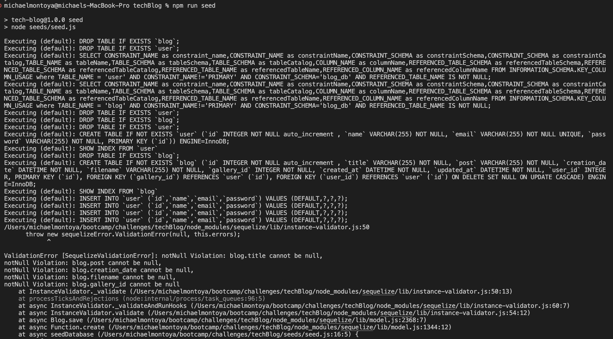

# techBlog
This is a tech blog that a user will be able to log in and post tech related things to their page
### Intallation:
to install the dependencies open the terminal and run:
npm i
mysql -u root -p, source db/schema.sql, exit sql
npm run seed
npm start
### Usage:
this app uses handlebars and other technologies to update different pages
### Contributors:
Keli-Rene Sparks
### screenshot:
an image of the error received when running seeds

### Links
[github](https://github.com/mmontoya1112/techBlog)
[heroku](https://tranquil-ridge-88852.herokuapp.com/)